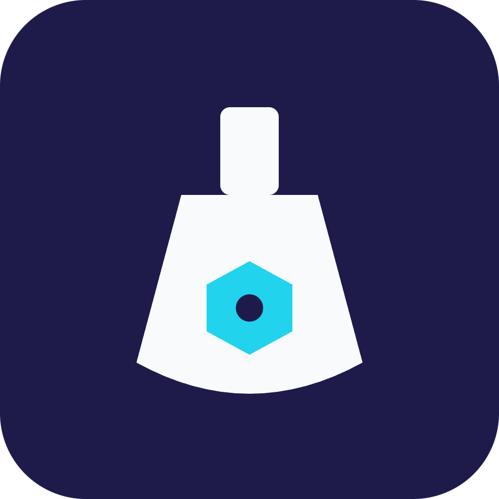

# NFTLab Sim


A hands-on sandbox simulating real NFT use-cases, unlocked through quiz progress.

## Overview

NFTLab Sim combines quiz-based learning with an interactive sandbox where users don't just answer questions about real NFT pilots—they actually mint, transfer, and redeem demo NFTs replicating those scenarios (e.g., ticket resale, loyalty points, membership access). This experiential approach helps investors and professionals truly grasp NFT mechanics before applying them to real assets.

## Problem

Reading or quizzing alone doesn't build real confidence in actually using NFTs. People fear making mistakes with real assets, so knowledge never turns into practical skill.

## Solution

NFTLab Sim lets users practice real NFT workflows risk-free in a simulated sandbox, unlocked progressively as they demonstrate quiz mastery. Every action — minting, transferring, redeeming — mirrors a real-world pilot use-case.

## Features (MVP)

- Quiz gates unlocking sandbox scenarios step by step
- Mint/transfer/redeem demo NFTs mimicking real pilot use-cases
- Scenario library: ticket resale, loyalty points, membership access
- Progress tracker showing completed real-world scenario simulations
- Shareable completion certificate NFT after finishing all scenarios

## Tech Stack

- Anchor
- Metaplex
- Next.js
- Solana Devnet
- Wallet Adapter
- PostgreSQL

## How It Works

```
[User] --quiz--> [Quiz Engine] --unlock--> [Sandbox Scenario]
                                              |
                                      mint / transfer / redeem
                                              |
                                     [Anchor Program + Metaplex]
                                              |
                                      [Solana Devnet]
                                              |
                                  [Progress Tracker (PostgreSQL)]
                                              |
                              [Certificate NFT on completion]
```

Users progress through quizzes tied to real NFT pilot scenarios. Passing a quiz unlocks the matching sandbox scenario, where a Next.js frontend with Wallet Adapter lets them mint, transfer, or redeem demo NFTs through an Anchor program using Metaplex standards, all on Solana Devnet. Progress is stored in PostgreSQL, and completing every scenario mints a shareable certificate NFT.

## Roadmap

- Add more real-world scenario modules based on new pilots
- Introduce social/competitive sandbox challenges
- Explore partnerships to turn simulated scenarios into real pilot onboarding

## Pitch

- [Pitch deck (PDF)](docs/pitch.pdf)
- [Pitch script](docs/pitch-script.md)

## Team

- Name — Role — [GitHub](#) / [Twitter](#)
- Name — Role — [GitHub](#) / [Twitter](#)
- Name — Role — [GitHub](#) / [Twitter](#)

Built for the Colosseum hackathon.

---

🎬 Pitch video: [docs/pitch-video.mp4](docs/pitch-video.mp4)

## v0.1 implementation

The repository now includes a Japanese Next.js learning app with three quiz-gated scenarios, browser simulation, Solana Devnet Metaplex Core mint/transfer/burn operations, and shareable completion certificates. Progress uses browser storage with optional PostgreSQL synchronization.

```sh
npm ci
cp .env.example .env.local
npm run dev
```

Open http://localhost:3000. No wallet or database is required for simulation mode.

See [development and verification guide](docs/development.md) for Devnet wallet setup, PostgreSQL schema, optional Anchor learning receipts, validation commands, and current limitations. Existing pitch materials describe the original concept; the guide describes the implementation.

Cloudflare Workers deployment configuration preserves the existing Next.js app, uses browser storage, serves publicly fetchable PNG metadata, and enables the verified Devnet receipt program. See [Cloudflare deployment instructions](docs/cloudflare-deployment.md). The app is deployed at [nftlab-sim.haruharuoharu.workers.dev](https://nftlab-sim.haruharuoharu.workers.dev); public metadata/PNG retrieval and PC Solflare certificate image/name display are verified.

**Status (2026-10-04 JST):** application tests, typecheck, production build, PostgreSQL integration, and desktop/mobile browser E2E are verified. Anchor 0.32.1 SBF/IDL generation and local chain checks pass. PC Solflare testing completed all three Core mint/transfer/burn scenarios and certificate minting on actual Devnet (10 finalized transactions). The optional Anchor program is deployed on Devnet at `BUdXZQwEUkSkQve9wmdzGG4kkz8ViGmvnJ1b2EDAviwR`; all nine receipt checks also pass on actual Devnet. RPC verification confirms six successful CLI receipt transactions and three completed test receipt accounts. The browser's “record completion” action also succeeded with the real Solflare wallet, recording all three scenarios in one finalized transaction without minting another certificate. Its receipt owner, program, completion mask, and timestamp match the transaction. PC verification also confirms that the receipt, completed scenarios, and existing certificate remain visible after browser reload and reconnection to the same wallet; the record button shows that completion is already recorded. See [Devnet verification evidence](docs/devnet-verification.md). Production npm audit reports 0 high/critical and 3 moderate entries with a documented reachability review. Public hosting, on-chain HTTPS certificate metadata, and PC Solflare image/name display are verified. The Seeker certificate flow is verified after the v0 receipt fix: the Anchor completion record and Core certificate mint both finalized successfully, and the certificate image/name appeared in the mobile wallet. The wallet lists it under Unverified collectibles. Wallet detail-description display and post-mint Seeker reload/reconnection retention remain to be checked. Certificates and Anchor receipts are self-reported educational records, not accredited or independently verified credentials. Anchor remains disabled in the app unless its environment variable is configured; Metaplex Core NFT actions directly use the existing Core program.

Pending transactions are saved before broadcast and can be recovered by their original signatures after reopening. Cross-tab transaction locks prevent overlapping wallet operations. See the [Solflare PC verification guide](docs/solflare-pc-test.md) to test with your own Devnet extension wallet; no custom-program deployment is needed for Core scenarios.
